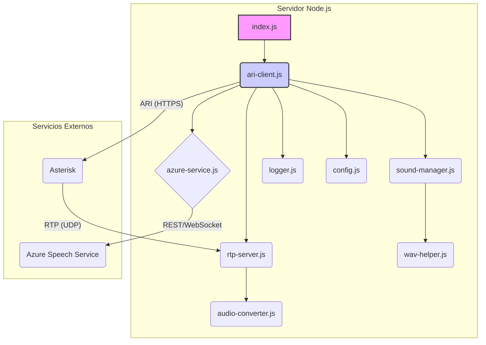
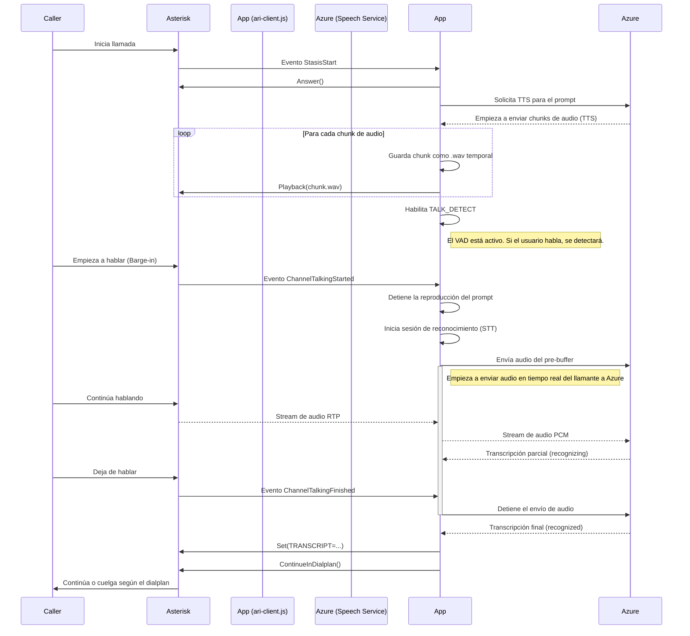

# Arquitectura de la Aplicación

Este documento describe la arquitectura general de la aplicación de integración entre Asterisk y Azure, detallando los componentes principales y el flujo de una llamada.

## 1. Descripción General

La aplicación actúa como un servicio de IVR (Respuesta de Voz Interactiva) inteligente que se conecta a Asterisk a través de ARI (Asterisk REST Interface). Su propósito es reproducir un audio de bienvenida (prompt), escuchar la respuesta del usuario, transcribirla usando los servicios de voz de Microsoft Azure y devolver el texto resultante al dialplan de Asterisk.

La arquitectura está diseñada para ser modular y robusta, manejando flujos de audio en tiempo real y gestionando el ciclo de vida de la llamada de forma segura.

## 2. Diagrama de Componentes

Este diagrama muestra los módulos principales de la aplicación y cómo interactúan entre sí y con los servicios externos.

-   **index.js**: Punto de entrada de la aplicación.
-   **ari-client.js**: Orquestador principal que maneja la lógica de la llamada.
-   **azure-service.js**: Encapsula toda la comunicación con los servicios de voz de Azure (TTS y STT).
-   **rtp-server.js**: Servidor UDP que recibe el audio del llamante desde Asterisk. Incluye un jitter buffer para reordenar paquetes.
-   **audio-converter.js**: Convierte el audio del formato `ulaw` (de Asterisk) a `PCM` (para Azure).
-   **sound-manager.js**: Gestiona la creación y limpieza de archivos de audio temporales (para streaming de TTS) y el guardado de grabaciones finales.
-   **wav-helper.js**: Utilidad para añadir cabeceras a archivos WAV.
-   **logger.js / config.js**: Módulos de utilidad para logging y configuración.

## 3. Diagrama de Secuencia de Llamada

Este diagrama ilustra el flujo de eventos y acciones durante una llamada típica, incluyendo el "barge-in" (cuando el usuario interrumpe el prompt).

